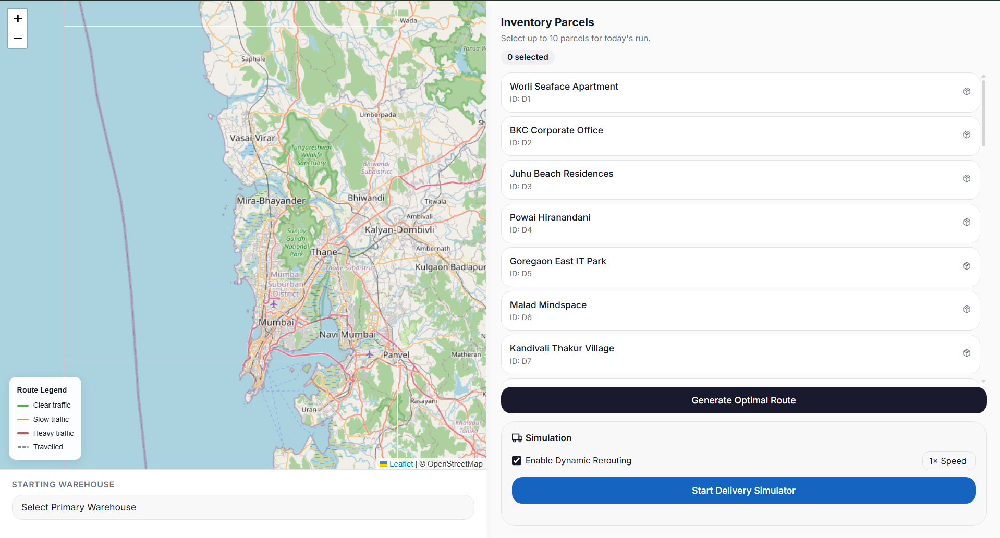

# Mumbai TSP Delivery App

## Project Overview
The Mumbai TSP Delivery App is a high-performance, interactive routing engine designed to optimize multi-stop delivery sequences within urban environments. By solving the classic Traveling Salesperson Problem (TSP) using real-world street network data, this application minimizes both delivery times and fuel consumption. 

Rather than relying on heavy enterprise frameworks, this project utilizes a custom-built, lightweight Java backend and a highly optimized C-compiled algorithmic engine to perform complex combinatorial optimization on the fly.

## Application Screenshots

> **Note:** Screenshots demonstrating the application's interface and routing capabilities are provided below.

**1. Main Dashboard and Route Input**
 

**2. Optimized Route Comparison**
 

**3. Traffic Simulation Execution**
 

 

## Key Features

* **Real-World Routing Integration:** Interfaces with the Open Source Routing Machine (OSRM) API to calculate accurate street-level driving, cycling, and walking distances.
* **Algorithmic Optimization:** Compares a "Naive" sequential route against a mathematically optimal TSP sequence, providing empirical proof of time and distance savings.
* **Dynamic Traffic Simulation:** Features a deterministic, seed-based traffic simulator that applies localized congestion multipliers to distance matrices, allowing for robust route stress-testing.
* **High-Availability Fallback Mechanism:** Incorporates the Haversine formula to calculate spherical Earth geospatial distances if the external OSRM API experiences rate-limiting or downtime.
* **Zero-Configuration Deployment:** Utilizes automated cross-platform startup scripts (Bash/Batch) to handle source compilation and server bootstrapping seamlessly.

## Technology Stack

This project is architected to operate without bloated dependencies, demonstrating strong fundamental software engineering practices.

* **Backend Server:** Pure Java (JDK), utilizing `com.sun.net.httpserver` for custom HTTP request handling and static file serving.
* **Secondary Compute Engine:** C, compiled via GCC with the `-O2` optimization flag to maximize raw hardware-level execution speed.
* **Frontend Interface:** Standard HTML, Cascading Style Sheets (CSS), and vanilla JavaScript.
* **External Data Provider:** OSRM (Open Source Routing Machine) API.
* **Automation & Scripting:** Bash (`run.sh`) for UNIX/macOS environments and Batch (`run.bat`) for Windows environments.

## Algorithmic Architecture

The routing engine employs two distinct algorithms to solve the NP-Hard Traveling Salesperson Problem, deploying them based on the execution context:

1. **Dynamic Programming with Bitmasking (Java Engine):** * **Time Complexity:** O(N² * 2^N)
   * **Methodology:** Capitalizes on overlapping subproblems and optimal substructure. It maps visited nodes to a binary integer (bitmask) and stores minimum path costs in a 2D array, effectively eliminating millions of redundant calculations compared to brute-force methods.

2. **Branch and Bound (C Engine):**
   * **Time Complexity:** O(N!) in the worst-case scenario.
   * **Methodology:** A highly optimized recursive solver that tracks the global minimum cost. It aggressively prunes search branches the moment a partial route's cost exceeds the established minimum, resulting in rapid resolutions for smaller datasets.

## Getting Started

### Prerequisites
To execute this project locally, the following development tools must be installed:
* **Java Development Kit (JDK 11 or higher):** Required to compile and host the backend server.
* **GCC Compiler:** Required to compile the Branch and Bound engine. 
  * *Windows Systems:* Install via MSYS2 / MinGW.
  * *macOS/Linux Systems:* Typically pre-installed or accessible via `build-essential` or `xcode-select`.

### Installation and Execution

1. **Clone the repository:**
   
   git clone [https://github.com/yourusername/TSP-Delivery-App-Simulator.git](https://github.com/yourusername/TSP-Delivery-App-Simulator.git)
   cd TSP-Delivery-App-Simulator.git
   

2. **Run the Initialization Script:**
   The project includes automated scripts that compile the C code, build the Java controller, and launch the server on port `4567`.

   * **For Windows:**
     Execute the batch file via the command prompt:
     
     run.bat
    
   * **For macOS / Linux:**
     Grant execution permissions and run the shell script:
     
     chmod +x run.sh
     ./run.sh
     

3. **Access the Application:**
   Open a standard web browser and navigate to: `http://localhost:4567`

## Future Scope

* **Vehicle Routing Problem (VRP) Integration:** Expanding the core algorithm to dispatch multiple delivery agents simultaneously from a centralized depot.
* **Heuristic Solvers:** Implementing algorithms such as Simulated Annealing or Genetic Algorithms to compute near-optimal routes for massive datasets (N > 30) where exact Dynamic Programming becomes computationally prohibitive.
* **Database Caching Layer:** Integrating PostgreSQL with PostGIS to cache frequent distance matrix calculations, thereby reducing external API overhead.

## Acknowledgements

* **Open Source Routing Machine (OSRM):** Recognized for providing open-source access to high-fidelity road network APIs.
* Developed as an academic exploration into logical implementation and the Design and Analysis of Algorithms (DAA).

